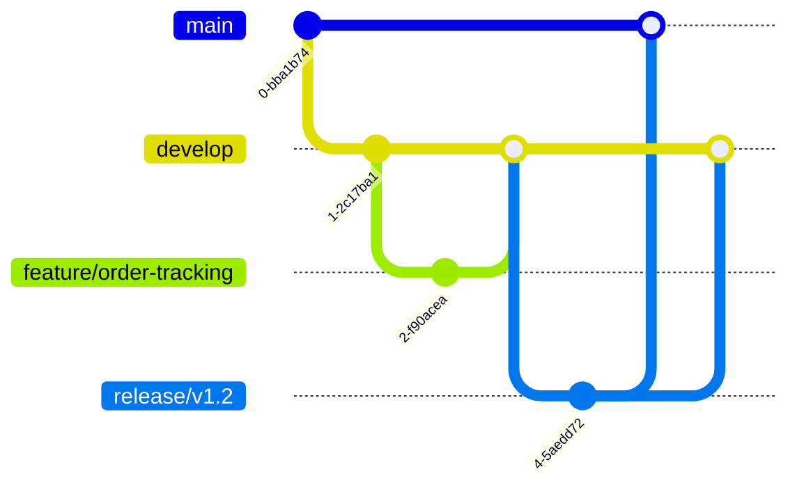

# 🍓 Merry Berry Smoothie & Açaí Shop

**Revolutionising healthy eating through seamless digital ordering**

Welcome to the official GitHub Organization for Merry Berry - a full-stack solution powering next-generation online ordering for health-focused food services.

## 🌟 Project Highlights

**Key Features**  
✅ Adding Soon

## 🛠️ Repository Ecosystem

| Repository | Description | Status |
|------------|-------------|--------|
| [merry-berry/client](https://github.com/merry-berry-acai/client) | Progressive Web App (React) | In Development ⚙️ |
| [merry-berry/server](https://github.com/merry-berry-acai/server) | API (Node.js) | In Development ⚙️ |
| [merry-berry/docs](https://github.com/merry-berry-acai/docs) | Technical Documentation | Maintained 📚 |

## 🚀 Getting Started

### System Requirements
- Node.js 18.x
- MongoDB 6.x

## 🧑💻 Development Workflow

### Git Strategy

---

**License**  
This project is licensed under the MIT License - see the [LICENSE](LICENSE) file for details.

*"Fueling Healthy Lifestyles Through Technology"* 🥤💻
